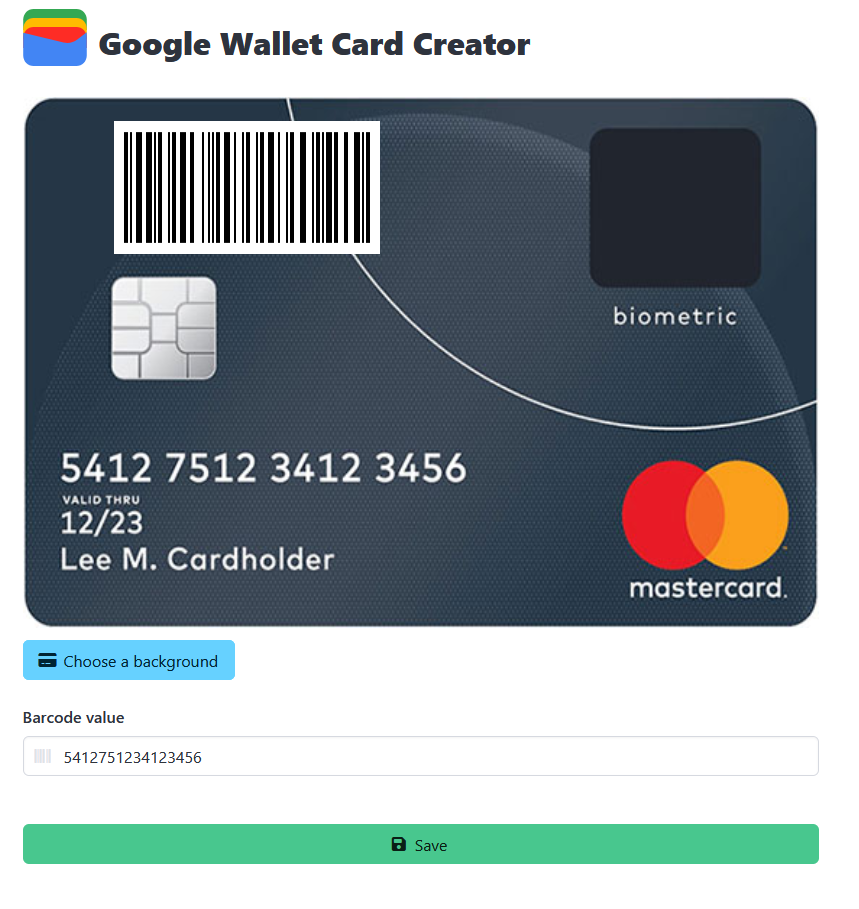

    

# Google Wallet Card Creator
The "Photo" option of Google Wallet is very easy to add a card to your wallet,
but sometimes you have a card without barcode that you do want to keep in the wallet app.

This website allows you to easily add a barcode to your card image so you can import it and keep it with the rest of your cards.

## Features
- Select card image
- Add a barcode based on text input
- Drag the barcode to a desired spot on your card image
- Resize the barcode so it fits anywhere on your card image 

## Screenshot

## Links
- [JsBarcode](https://github.com/lindell/JsBarcode)
- [Interact.js](https://interactjs.io/)
- [html2canvas](https://html2canvas.hertzen.com/)
- [FileSaver.js](https://github.com/eligrey/FileSaver.js)
- [Bulma](https://bulma.io/)
- [Font Awesome](https://fontawesome.com/)